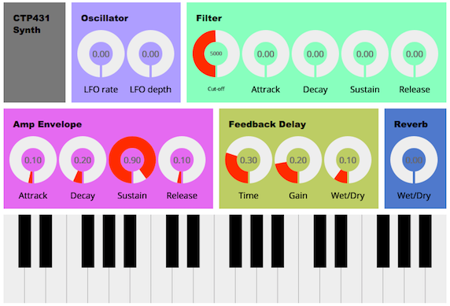

# Homework 3: Music Synthesizer

You are going to design a music synthesizer that generates musical sounds based on subtractive synthesis. The start-up code is provided so that you can easily work on it. To begin with it, remove the "_startup" suffix from the filenames.

## Step #1 
A simple synth that generates tones with oscillator, filter and amplitude envelope is already implemented in the start-up code. Your mission is going to add two types of controllers, LFO (Low Frequency Oscillator) and ENV (Envelope) to it. The LFO is connected to the oscillator frequency to control pitch (i.e. vibrato), and the ENV is connected to the filter cutoff-frequency to control timbre. In order to implement them, modify hw3.js and synth.js on your own.       

## Step #2
We use two types of audio effect units, feedback delay and reverb, to enrich the synth sound. The delay unit is already implemented. Your job is adding the reverb based on convolution. Regarding the room impulse response, you should pick it up from [http://www.openairlib.net/](http://www.openairlib.net/). After choosing the impulse response file, ensure that the sampling rate is 44100 Hz/sec. Otherwise, resample it using Audition or Audacity. Referring to delay.js, implement the convolution reverb in reverb.js file. Note that you should rewire the units such that the delay is connected to the reverb, and the reverb is to the DAC. 

## Step #3
Design your own synth sound by adjusting the parameters displayed on the GUI. Submit your code with the parameters. 

